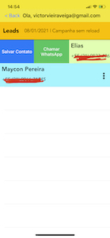
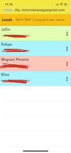

<!--
*** Thanks for checking out the Best-README-Template. If you have a suggestion
*** that would make this better, please fork the repo and create a pull request
*** or simply open an issue with the tag "enhancement".
*** Thanks again! Now go create something AMAZING! :D
-->

<!-- TODO LIST -->
<!--
*** I'm using markdown "reference style" links for readability.
*** Reference links are enclosed in brackets [ ] instead of parentheses ( ).
*** See the bottom of this document for the declaration of the reference variables
*** for contributors-url, forks-url, etc. This is an optional, concise syntax you may use.
*** https://www.markdownguide.org/basic-syntax/#reference-style-links
-->

<!-- PROJECT LOGO -->
 

  

  <h3 align="center">Honney App iOS</h3>

  

    App para facilitar a comunicação interna de colaboradores envolvidos em campanhas da empresa
     
    <a href="https://github.com/victorvieiraveiga/HoneySms"><strong>Explore the docs »</strong></a>
     
     
    <a href="https://github.com/victorvieiraveiga/HoneySms">View Demo</a>
    ·
    <a href="https://github.com/victorvieiraveiga/HoneySms/issues">Report Bug</a>
    ·

<!-- TABLE OF CONTENTS -->

  
Indice

  <ol>
    <li>
      <a href="#about-the-project">Sobre o Projeto</a>
      <ul>
        <li><a href="#built-with">Construido com</a></li>
      </ul>
    </li>
    <li>
      <a href="#getting-started">Começando</a>
      <ul>
        <li><a href="#prerequisites">Pré Requisitos</a></li>
      </ul>
    </li>
    <li><a href="#contact">Contato</a></li>
  </ol>

<!-- ABOUT THE PROJECT -->
## Sobre o Projeto

Aplicativo Mobile Desenvolvido em Swift. Consumo de API do Cliente, realizando operaçoes de Get, Post e Autenticação com Token.
Dentre as possibilidades o colaborador pode informa o interesse em alguma campanha. Chamar outro colaborador no WhatsApp, salvar contato de outros colaboradores em seu dispositivo fisico.

<table>
  <tbody>
    <tr>
      <td>  </td>
      <td>  </td>
      <td>  </td>
      <td>  </td>
      <td>  </td>
    </tr>
  </tbody>
</table>

OBS: Este projeto foi construido como exercicio do curso de iOS da Dra [Angela Yu] (https://www.linkedin.com/in/angela-yu-963a584b/)

### Desenvolvido Com

* [Swift 5.3.1](https://www.apple.com/br/swift/)
* [XCode](https://developer.apple.com/xcode/)
* [ApiRest]

<!-- CONTACT -->
## Contato

Project Link: [Linkedin](https://www.linkedin.com/in/victor-vieira-veiga-96867157/)

